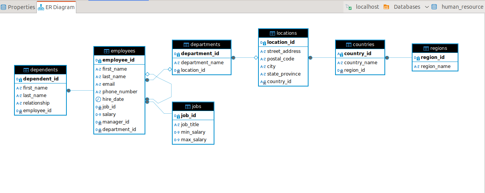

### Human Resource Management Database

This is a database which can be used by the human resource department of small businesses. It is used to manage employees and track their dependents, region and country.

### Implementation
We used the MySQL Database Management System to implement the HR sample database. 

*The HR Database has the following tables:*
1. The _employees_ table storing the data of employees.
2. The _jobs_ table storing the job data including the job title and salary range.
3. The _departments_ table storing the department data.

4. The _dependents_ table storing the employee's dependents
5. The _locations_ table storing the location of the company's departments.
6. The _countries_ table stores the data of countries where the company is doing business.
7. The _regions_ table stores the data of regions like Africa, Asia, Europe, America, and the Middle East where countries are classified and grouped into.

#### ER Diagram
This shows the Entity-Relationship diagram of the sample HR database.

