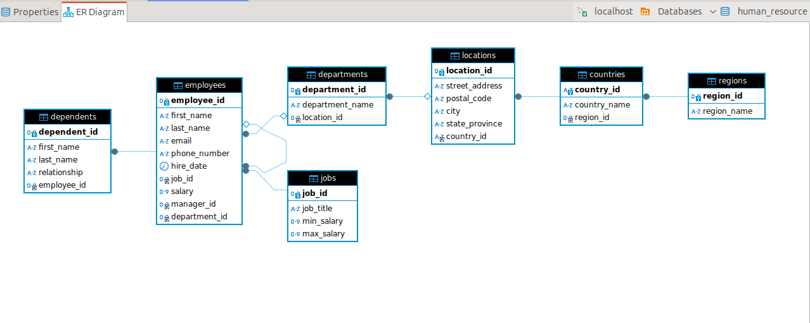

### Human Resource Management Database

This is a database which can be used by the human resource department of small businesses. It is used to manage employees and track their dependents, region and country.

### Implementation
We used the MySQL Database Management System to implement the HR sample database. 

*The HR Database has the following tables:*
1. The _employees_ table storing the data of employees.
2. The _jobs_ table storing the job data including the job title and salary range.
3. The _departments_ table storing the department data.

4. The _dependents_ table storing the employee's dependents
5. The _locations_ table storing the location of the company's departments.
6. The _countries_ table stores the data of countries where the company is doing business.
7. The _regions_ table stores the data of regions like Africa, Asia, Europe, America, and the Middle East where countries are classified and grouped into.

#### ER Diagram
This shows the Entity-Relationship diagram of the sample HR database.

### COUNT(*)
* Used in retutrning the total number of rows in a table.
* Syntax:
		SELECT COUNT(*) FROM <tableName>;

* COUNT(*) can also be used together with the WHERE keyword to return the total number of rows which meet the condition specified in the WHERE clause.

### SUM
* SUM keyword is used in finding the sum of a value in a table.
* Syntax:

	SELECT SUM(columnName) FROM <tableName>;

### AVG()
* AVG is used to find the average of a value from a table.
* Syntax:

	SELECT AVG(columnName) FROM <tableName>;

### MAX() and MIN()
* MAX keyword is used to find the maximum value while MIN keyword is used in Findinding the lowest values from a table.
* Syntax:

	SELECT MAX(columnName) FROM <tableName>;
### GROUP BY
* Used to aggregate functions such as COUNT, SUM, AVG, MAX and MIN.
* It splits the table into different piles baased on the value of each row.
* Syntax:

	SELECT COUNT(*), columnName1 FROM <tableName> GROUP BY columnName1;

### Nested Queries
* SQL allows one to put a query inside another query.
* The nested query is put in parenthesis and it is executed first before the main query is executed.
* Syntax:

	SELECT * FROM <tableName> WHERE columnName (SELECT MAX(columnName) FROM tableName);

### NULL
* Used to return a row where a given column has no value.
* IS NOT NULL does the reverse of NULL.
* Syntax:

	SELECT * FROM tableName WHERE columnName IS NULL;

